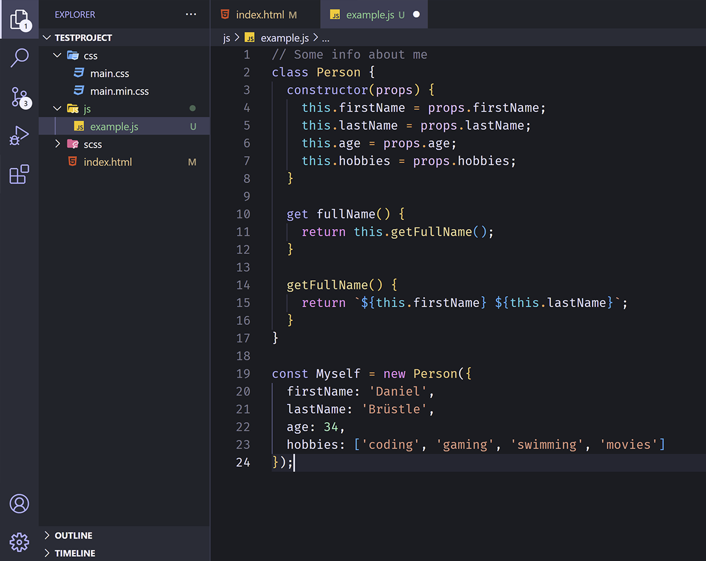
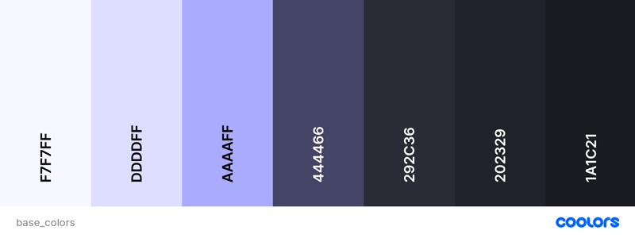
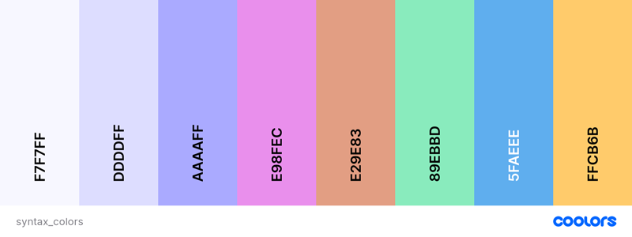
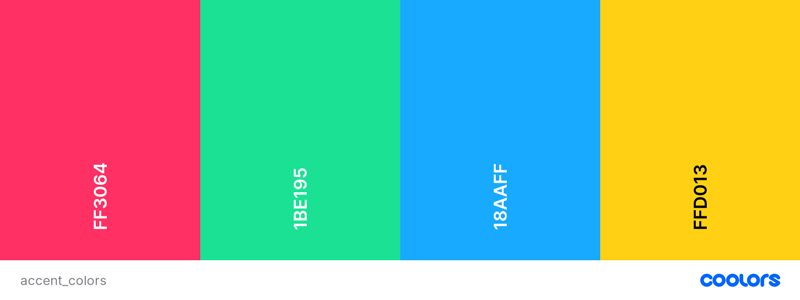

# Cean Dark - Color Theme

Simple but colorful theme that uses dark base colors with a tint of purple mixed with light colors for syntax highlighting and bright vibrant colors for errors, warnings and info messages.

---

## PREVIEW

---

## COLORS

